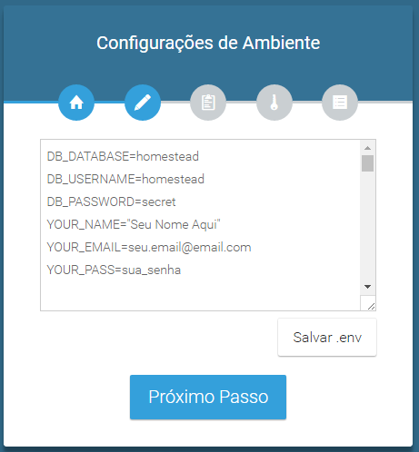

# BusMan - Lite#

Solução open source para gerenciamento de receitas e despensas. Ideal para uso pessoal e em pequenas empresas. Uso individual.

Caso deseje customização, melhora no desenpenho, layout ou mais funções, entre em contato como [desenvolvedor](https://albasolucoes.com).

### Instalação ###

* Clone e instale as dependências com composer
```
    git clone https://github.com/albasolucoes/busman.git

    composer install
```
* Suba os aquivos para sua hospedagem
* Acesse http://exemplo.com/install (Onde "http://exemplo.com" deve ser substituido pelo seu domínio)
* Siga as instruções do instalador.

** No passo 2, é necessário informar dados válidos de acesso ao banco de dados, assim como criar as credenciais do futuro administrador do sistema.



* Resolva possíveis problemas com módulos e permissionamentos de pastas, reportados nos passos seguintes do instalador.

* Enjoy :satisfied:

### Manual de Usuário ###

* *[Em construção]*

### Recursos utilizados ###

* [Laravel 5.3](https://github.com/laravel/laravel)
* [Admin LTE Template](https://github.com/almasaeed2010/AdminLTE/)
* [LaravelInstaller](https://github.com/RachidLaasri/LaravelInstaller)

### Com quem falar ###

* Para contratação de serviços: [contato@albasolucoes.com](mailto:contato@albasolucoes.com)
* Para reportar um erro: Abra um [Issue](https://github.com/albasolucoes/busman/issues)
* Site do desenvolvedor: [Alba Soluções Web](https://albasolucoes.com)